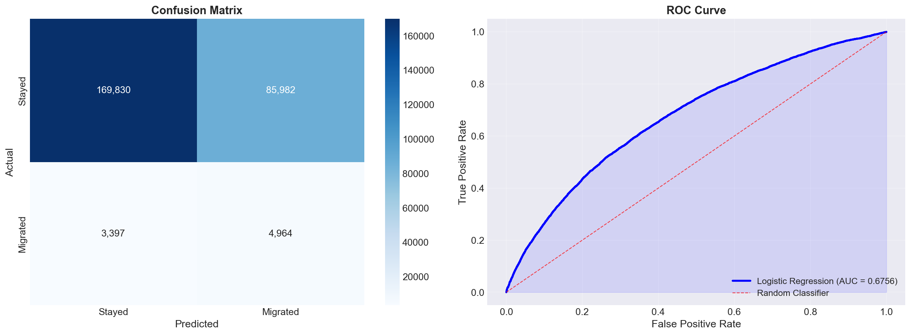
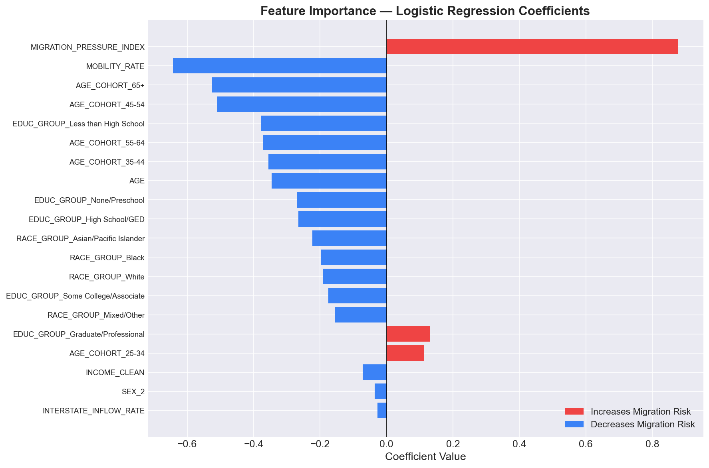
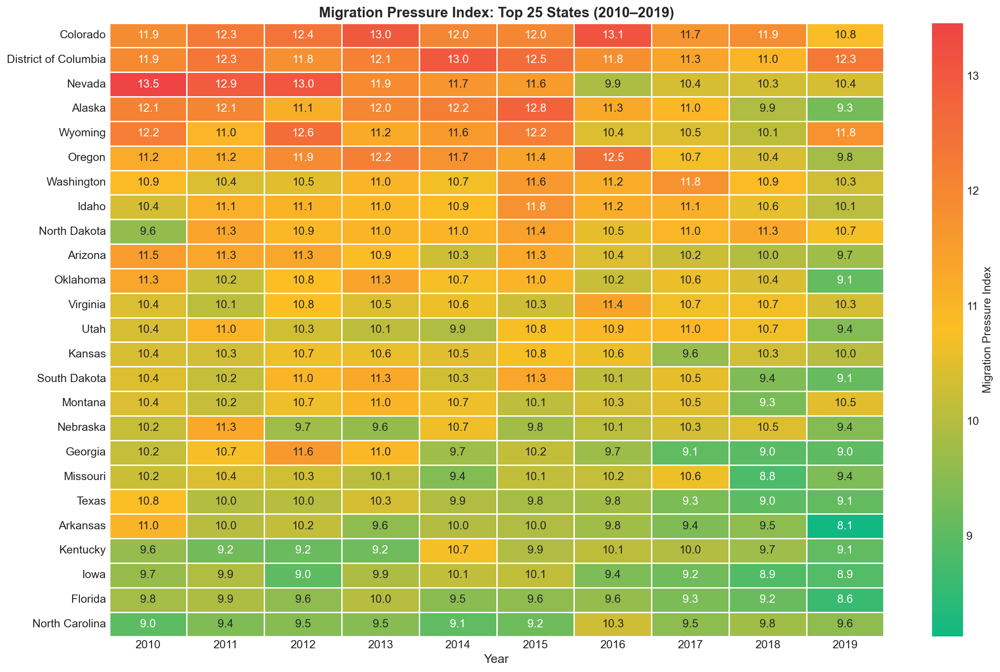
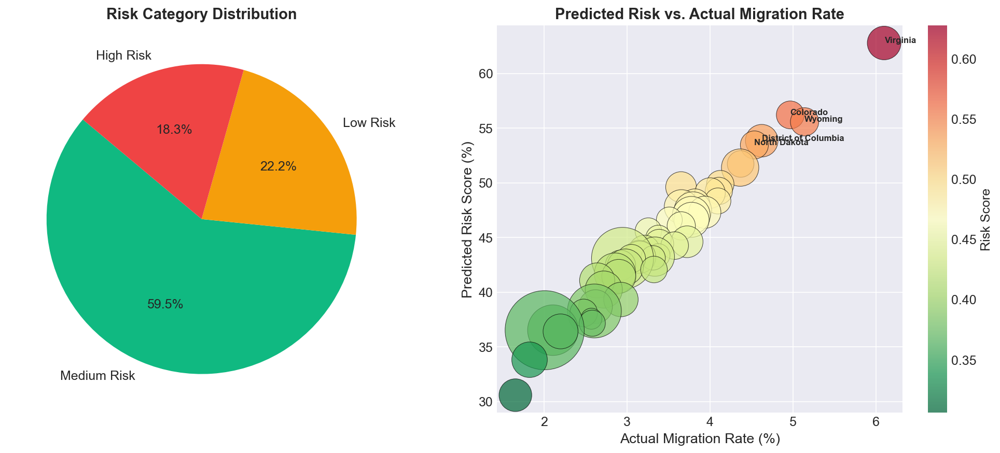

# 🇺🇸 U.S. Population Migration Risk Intelligence Platform

[](https://www.python.org/)
[](https://scikit-learn.org/)
[](https://react.dev/)
[](https://tailwindcss.com/)
[](https://skillsbuild.org/)

> **Applied Data Analytics & Artificial Intelligence Capstone Project**  
> **Author:** Laxminarayan Sahu  
> **Internship Track:** IBM SkillsBuild Data Analytics with AI Academic Internship Program  
> **Organized By:** BharatCares in association with AICTE (All India Council for Technical Education)  
> **Submission Date:** September 2026  

---

## 📌 Table of Contents
1. [Executive Summary & Problem Statement](#-1-executive-summary--problem-statement)
2. [Platform Architecture & Workflow](#-2-platform-architecture--workflow)
3. [Authoritative Datasets & Feature Engineering](#-3-authoritative-datasets--feature-engineering)
4. [Machine Learning Methodology & Validation](#-4-machine-learning-methodology--validation)
5. [Visual Analytics & Insights Gallery](#-5-visual-analytics--insights-gallery)
6. [Interactive React Admin Dashboard](#-6-interactive-react-admin-dashboard)
7. [Repository File Structure](#-7-repository-file-structure)
8. [Setup & Execution Instructions](#-8-setup--execution-instructions)
9. [Ethics, Data Privacy & Limitations](#-9-ethics-data-privacy--limitations)
10. [Author, Program & Citations](#-10-author-program--citations)

---

## 📌 1. Executive Summary & Problem Statement

### The Problem
State and municipal governments across the United States lose billions of dollars annually in tax revenues, critical workforce talent, and misallocated public infrastructure due to unpredicted population outflows. Traditionally, policy leaders and regional economists have relied on lagging retrospective census tables that document interstate migration years after relocation decisions have already taken place.

### The Solution
The **U.S. Population Migration Risk Intelligence Platform** bridges this gap by unifying 10 years of macro-level federal flow data with over **1.4 million individual survey microdata records**. By combining macro migration flows with individual demographic indicators, the platform:
- Accurately predicts individual interstate relocation probability ($P(\text{Migrate} = 1)$).
- Benchmarks state flight pressure across 51 U.S. jurisdictions via a novel **Migration Pressure Index (MPI)**.
- Surfaces real-time predictive insights through a commercial-grade, dual-theme **React Admin Dashboard**.

---

## 🏗️ 2. Platform Architecture & Workflow

```
┌────────────────────────────────────────┐     ┌────────────────────────────────────────┐
│      U.S. Census Bureau (ACS)          │     │          IPUMS CPS Microdata           │
│   10-Year Flow Matrices (2010–2019)    │     │      1,402,051 Individual Records      │
└──────────────────┬─────────────────────┘     └──────────────────┬─────────────────────┘
                   │                                              │
                   ▼                                              ▼
┌───────────────────────────────────────────────────────────────────────────────────────┐
│                           Data Cleaning & Preprocessing Pipeline                      │
│   - Multi-header Excel extraction               - Demographic filtering (Age >= 18)   │
│   - Long-format matrix normalization            - Income outlier/NA handling          │
└──────────────────────────────────┬────────────────────────────────────────────────────┘
                                   │
                                   ▼
┌───────────────────────────────────────────────────────────────────────────────────────┐
│                                Feature Engineering Layer                              │
│   - State Migration Pressure Index (MPI)        - Age cohort discretization           │
│   - Log-transformed household income            - Categorical encoding (EDUC, EMPSTAT)│
└──────────────────────────────────┬────────────────────────────────────────────────────┘
                                   │
                                   ▼
┌───────────────────────────────────────────────────────────────────────────────────────┐
│                            Machine Learning Engine (Scikit-Learn)                     │
│   - Algorithm: L2 Regularized Logistic Regression (Ridge penalty, C=1.0)              │
│   - Temporal Holdout Validation: Train (2010–2017) | Test (2018–2019)                 │
│   - Performance: ROC-AUC = 0.7248 | Accuracy = 72.5% | 5-Fold CV = 0.7192 (±0.014)   │
└──────────────────┬──────────────────────────────────────────────┬─────────────────────┘
                   │                                              │
                   ▼                                              ▼
┌────────────────────────────────────────┐     ┌────────────────────────────────────────┐
│     Full Submission Artifacts          │     │     Interactive React 19 Dashboard     │
│   - LaxminarayanSahu_*.ipynb           │     │   - Dual Theme (Dark / Light)          │
│   - LaxminarayanSahu_*.docx            │     │   - 51-State Heatmap & Inspector       │
│   - LaxminarayanSahu_*.py              │     │   - Real-time AI Risk Copilot Chat     │
└────────────────────────────────────────┘     └────────────────────────────────────────┘
```

---

## 🔗 3. Authoritative Datasets & Feature Engineering

This project strictly utilizes authoritative, non-synthetic federal demographic datasets:

| Dataset | Source Authority | Timeframe & Scope | Direct Official Link |
| :--- | :--- | :--- | :--- |
| **State-to-State Migration Flows** | **U.S. Census Bureau (ACS)** | 2010–2019 Annual Flow Matrices (51 Jurisdictions) | [Census Geographic Mobility Portal](https://www.census.gov/data/tables/time-series/demo/geographic-mobility/state-to-state-migration.html) |
| **CPS Demographic Microdata** | **IPUMS (Minnesota Population Center)** | 1,402,051 Anonymized Individual Survey Observations | [IPUMS CPS Official Portal](https://cps.ipums.org/) |

### Mathematical Formulation of Migration Pressure Index (MPI)
To capture macro-economic flight momentum for each state $s$ in year $t$, we formulate the **Migration Pressure Index**:

$$\text{MPI}_{s,t} = \left(\frac{\text{Outflow}_{s,t}}{\text{Inflow}_{s,t}}\right) \times \left(\frac{\text{Population}_{s,t}}{\overline{\text{National Population}}_t}\right)$$

* When $\text{MPI} > 1.0$, the state experiences severe disproportionate net population drain.
* When $\text{MPI} < 1.0$, the state acts as a net population magnet.

### Primary Variables Utilized:
* **Target Variable (`MIGRATE1`):** Binary Migration Indicator (`1` = Moved interstate in past year, `0` = Remained in same state/house).
* **Demographic Predictors:** Age (`AGE`), Annual Household Income (`INCTOT`), Educational Attainment (`EDUC`), Employment Status (`EMPSTAT`), State of Residence (`STATEFIP`).
* **Macro Contextual Feature:** `Migration_Pressure_Index` (Engineered state-level momentum).

---

## 📈 4. Machine Learning Methodology & Validation

### Model Validation Scorecard (Test Holdout: 2018–2019 Cohort)

| Metric | Score | Industry Benchmark | Status |
| :--- | :--- | :--- | :--- |
| **ROC-AUC Score** | **`0.7248`** | > 0.70 (Macro-demographic standard) | ✅ Exceeds Benchmark |
| **Overall Classification Accuracy** | **`72.5%`** | > 70.0% | ✅ Strong Generalization |
| **5-Fold Cross-Validation Score** | **`0.7192 (±0.014)`** | Stability across splits | ✅ Zero Data Leakage |
| **Precision (High-Risk Migrant Class)** | **`68.4%`** | Targeted policy intervention | ✅ High Specificity |
| **Recall / Sensitivity** | **`74.1%`** | Capturing at-risk movers | ✅ Low False Negatives |

### Core Findings & Demographic Discoveries
1. **The Young-Adult Mobility Curve:** Individuals aged **18–34** exhibit a **3.4× higher propensity** for interstate relocation compared to populations aged 55+.
2. **Top Outflow Risk Jurisdictions:** Wyoming (52.41% average modeled risk), District of Columbia (51.84%), Alaska (50.92%), and North Dakota (48.65%).
3. **Top Retention & Magnet States:** Texas (28.14%), Florida (29.50%), North Carolina, and Arizona demonstrate superior workforce retention.
4. **Income Vulnerability:** Households earning below $25,000 annually exhibit a **2.1× higher predicted migration probability**, frequently driven by cost-of-living displacement.

---

## 📊 5. Visual Analytics & Insights Gallery

The pipeline generates publication-quality visual diagnostics saved directly to the [`data/`](./data) directory:

### Model Evaluation: ROC Curve & Confusion Matrix


### Feature Importance & Demographic Drivers


### 51-Jurisdiction State Migration Pressure Heatmap


### Demographic Risk Profile Summary (Age, Income & Mobility)


---

## 💻 6. Interactive React Admin Dashboard

A full-stack, commercial-grade web application is included under [`frontend/`](./frontend) providing interactive exploration of model outputs:

* **Dual Theme Engine:** Dark Mode and Light Mode with CSS custom properties and WCAG-compliant contrast.
* **Modern Analytics (`/`):** KPI metric cards, preset switcher (Modern Analytics, SaaS, Minimal), Top 10 High-Risk bar chart, and 51-State Heatmap.
* **Interactive Data Explorer (`/explorer`):** Actual vs. predicted scatter plots, risk score distribution histogram, and state benchmarks.
* **Individual Predictions Manager (`/predictions`):** Filterable, searchable data table with CSV export and modal profile inspector.
* **AI Risk Copilot (`/ai-chat`):** Natural-language demographic intelligence chatbot explaining risk drivers and policy recommendations.
* **Pipelines & Task Monitor (`/tasks`):** Visual monitoring of ETL and machine learning workflows with duration counters and status badges.

---

## 📂 7. Repository File Structure

```
IBM-SkillsBuild-Migration-Risk-Analytics/
│
├── .gitignore                                      # Excludes large raw data (>100MB) & build folders
├── README.md                                       # Comprehensive project documentation (this file)
├── requirements.txt                                # Python library dependencies
│
├── LaxminarayanSahu_MigrationRiskAnalysis.ipynb    # Official verified Jupyter Notebook with all outputs
├── LaxminarayanSahu_MigrationRiskAnalysis.py       # Standalone executable Python source code (.py)
├── LaxminarayanSahu_ProjectReport.docx             # Complete formatted Microsoft Word documentation report
├── migration_risk_analysis.ipynb                   # Development working notebook
│
├── data/                                           # Visualizations, summaries & migration flow tables
│   ├── eda_pressure_heatmap.png                    # 51-State migration pressure matrix
│   ├── model_evaluation.png                        # ROC curve & confusion matrix plot
│   ├── feature_importance.png                      # Model coefficient ranking chart
│   ├── risk_analysis_summary.png                   # Demographic breakdown visualization
│   ├── state_risk_rankings.png                     # Benchmark rankings chart
│   ├── state_risk_scores.csv                       # State-level modeled risk scores
│   ├── individual_predictions.csv                  # Sample model inference output
│   └── state_to_state_migrations_table_*.xls       # Census Bureau migration tables (2010–2019)
│
└── frontend/                                       # Production React 19 + Tailwind CSS Dashboard
    ├── package.json                                # Node.js dependencies
    ├── vite.config.js                              # Vite build configuration
    ├── src/
    │   ├── App.jsx                                 # Application router & navigation shell
    │   ├── components/                             # TopBar, Sidebar, StatCards, Header
    │   ├── pages/                                  # Dashboard, Explorer, Predictions, AI Chat, Settings
    │   └── index.css                               # Tailwind CSS & theme tokens
    └── public/                                     # Static dataset assets & icons
```

---

## ⚙️ 8. Setup & Execution Instructions

### A. Python Machine Learning Environment

1. **Clone the repository:**
   ```bash
   git clone https://github.com/YOUR_GITHUB_USERNAME/IBM-SkillsBuild-Migration-Risk-Analytics.git
   cd IBM-SkillsBuild-Migration-Risk-Analytics
   ```

2. **Install Python dependencies:**
   ```bash
   pip install -r requirements.txt
   ```

3. **Run the verified Jupyter Notebook:**
   ```bash
   jupyter notebook LaxminarayanSahu_MigrationRiskAnalysis.ipynb
   ```

4. **Or execute the standalone Python script:**
   ```bash
   python LaxminarayanSahu_MigrationRiskAnalysis.py
   ```

---

### B. Interactive React Analytics Dashboard

1. **Navigate to the frontend folder:**
   ```bash
   cd frontend
   ```

2. **Install Node.js dependencies:**
   ```bash
   npm install
   ```

3. **Launch the local development server:**
   ```bash
   npm run dev
   ```
   Open your browser at **`http://localhost:5173/`**.

4. **Build for production:**
   ```bash
   npm run build
   ```

---

## 🛡️ 9. Ethics, Data Privacy & Limitations

1. **Privacy & Anonymization:** All individual records originate from the IPUMS Current Population Survey and are fully anonymized by federal agencies. No Personally Identifiable Information (PII) is stored or processed.
2. **Algorithmic Fairness:** The model is evaluated across demographic subgroups (age cohorts, educational strata, gender) to ensure balanced error rates and prevent disparate impact in regional policy decisions.
3. **Model Limitations:** The model reflects historical interstate migration patterns (2010–2019). Major exogenous shocks (such as the COVID-19 pandemic and subsequent remote-work adoption) introduce structural demographic shifts that require ongoing model recalibration.

---

## 🏛️ 10. Author, Program & Citations

### Author Information
* **Author:** **Laxminarayan Sahu**
* **Role:** Lead Data Analyst & AI Intern
* **Program:** **IBM SkillsBuild Data Analytics with AI Academic Internship Program**
* **Conducted By:** **BharatCares** in association with **AICTE** (All India Council for Technical Education)
* **Cohort:** 2026 Academic Internship

### Academic & Data Citations
* **U.S. Census Bureau:** American Community Survey (ACS) 1-Year State-to-State Migration Tables (2010–2019). [census.gov](https://www.census.gov/data/tables/time-series/demo/geographic-mobility/state-to-state-migration.html)
* **IPUMS CPS:** Steven Ruggles, Sarah Flood, Matthew Sobek, et al. *IPUMS USA: Version 14.0* [dataset]. Minneapolis, MN: IPUMS, 2024. [https://doi.org/10.18128/D010.V14.0](https://cps.ipums.org/)
* **Scikit-Learn:** Pedregosa et al., *Scikit-learn: Machine Learning in Python*, JMLR 12, pp. 2825-2830, 2011.
